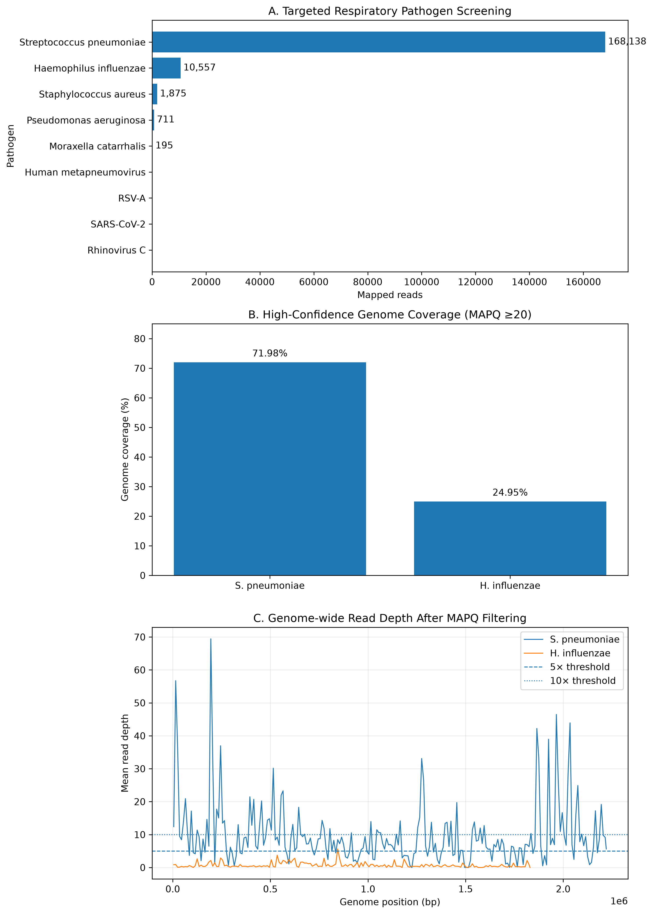
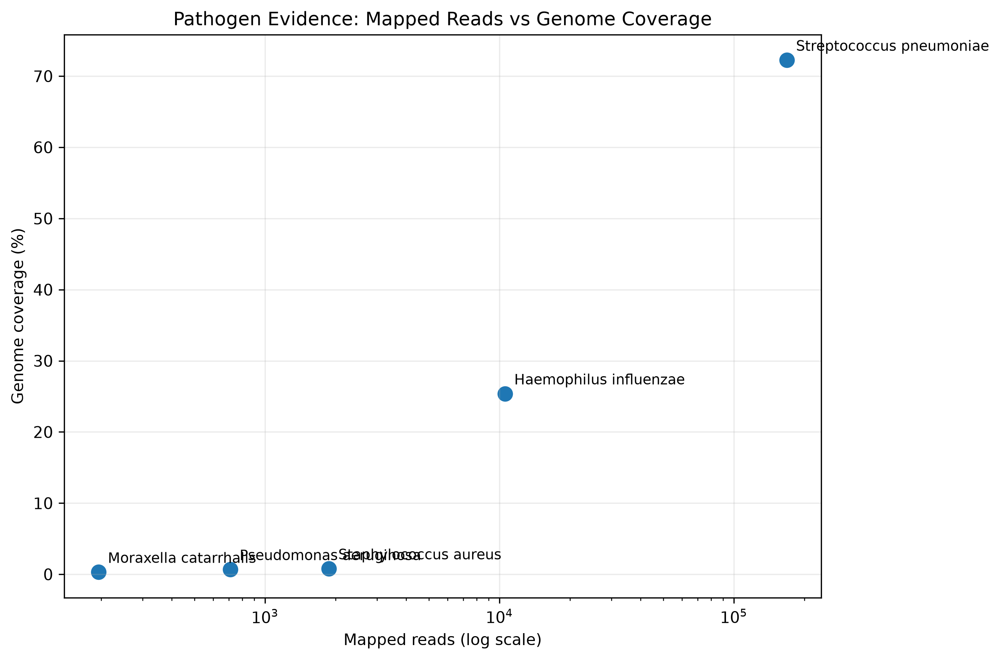
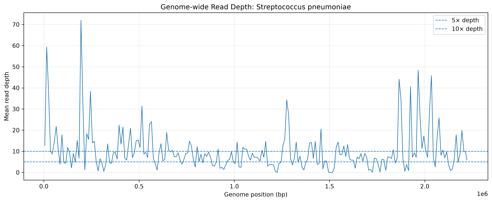

# Respiratory Metagenomics: Pathogen Evidence Analysis

A reference-based shotgun metagenomics workflow for evaluating computational evidence of respiratory pathogens from paired-end sequencing data.

## Overview

This project analyzes paired-end shotgun metagenomic sequencing data from a respiratory sample to investigate computational evidence for respiratory pathogens using targeted reference-based read mapping.

Rather than treating read alignment alone as evidence of infection, the workflow evaluates pathogen-specific mapping using alignment quality, genome-wide coverage, and read depth to distinguish stronger signals from low-level or tentative mapping evidence.

## Research Question

> Can pathogen-specific reference mapping and genome-wide coverage analysis identify robust sequencing evidence for respiratory pathogens in shotgun metagenomic data?

## Dataset

- **Sample:** ERR970398
- **Sequencing strategy:** Paired-end shotgun metagenomic sequencing
- **Reference source:** NCBI representative pathogen genomes
- **Alignment:** BWA-MEM
- **Alignment processing:** SAMtools
- **Analysis:** Python, pandas, matplotlib

## Targeted Pathogen Panel

The reference panel included representative genomes from:

- *Streptococcus pneumoniae*
- *Haemophilus influenzae*
- *Staphylococcus aureus*
- *Pseudomonas aeruginosa*
- *Moraxella catarrhalis*
- Rhinovirus C
- SARS-CoV-2
- Respiratory syncytial virus A
- Human metapneumovirus

## Analysis Workflow

```text
Paired-end metagenomic reads
            |
            v
        Read QC
            |
            v
    Read preprocessing
            |
            v
       Host depletion
            |
            v
  Target pathogen references
            |
            v
       BWA-MEM alignment
            |
            v
      SAM/BAM sorting
            |
            v
      MAPQ >= 20 filtering
            |
            v
 Genome-wide coverage + depth
            |
            v
  Pathogen evidence ranking
            |
            v
 Visualization + interpretation
```

## Key Results

The analysis identified substantial differences in pathogen-specific mapping evidence across the targeted reference panel.

| Pathogen | Mapped Reads | Genome Coverage | ≥5× Coverage | ≥10× Coverage | Mean Depth | Interpretation |
|---|---:|---:|---:|---:|---:|---|
| *Streptococcus pneumoniae* | 168,138 | 71.98% | 47.56% | 25.93% | 9.81× | Strong computational evidence |
| *Haemophilus influenzae* | 10,557 | 24.95% | 0.94% | 0.00% | 0.73× | Secondary / tentative evidence |

### Main observations

- *Streptococcus pneumoniae* showed the strongest genome-wide mapping signal, with approximately **72% genome coverage** and a mean sequencing depth of approximately **9.8×**.
- Nearly **48% of the pneumococcal reference genome** was covered at ≥5× depth, while approximately **26%** was covered at ≥10× depth.
- *Haemophilus influenzae* showed substantially weaker evidence, with approximately **25% genome coverage** but only **0.94%** of the genome covered at ≥5× and an average depth below **1×**.
- *Staphylococcus aureus*, *Pseudomonas aeruginosa*, and *Moraxella catarrhalis* showed only minimal mapped-read signals in this targeted analysis.
- The results demonstrate why **mapped-read count alone is insufficient** for interpreting metagenomic pathogen evidence; genome-wide coverage and read depth provide important additional context.

These findings represent computational sequencing evidence from reference-based mapping and **should not be interpreted as a clinical diagnosis or confirmation of infection**.

## Results Visualization

### Pathogen Evidence Overview

The combined analysis shows substantial variation in pathogen-specific sequencing evidence across the targeted reference panel. *Streptococcus pneumoniae* produced the strongest signal, with substantially higher mapped-read counts and genome-wide coverage than the other screened organisms.



### Mapped Reads vs Genome Coverage

Mapped-read abundance was evaluated together with genome-wide coverage to distinguish concentrated mapping signals from broader reference-genome representation.



### Genome-wide Coverage of Streptococcus pneumoniae

For the strongest computational signal, genome-wide read depth was examined across the *S. pneumoniae* reference genome following MAPQ filtering.


